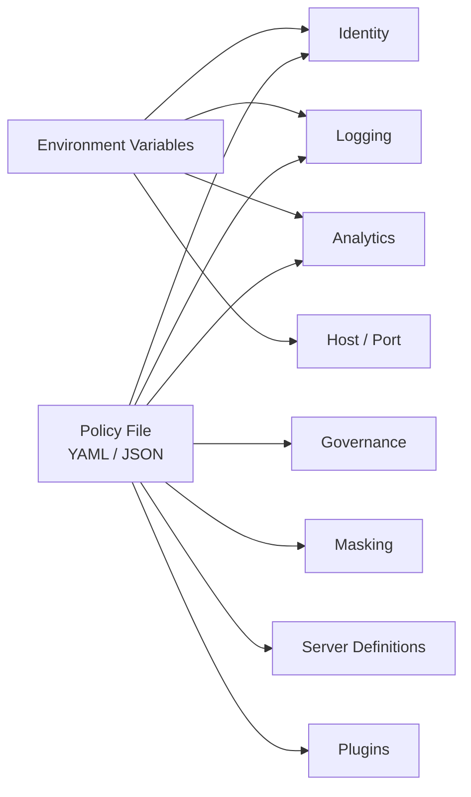
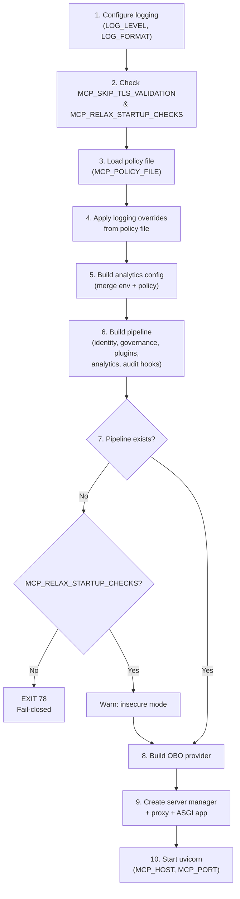
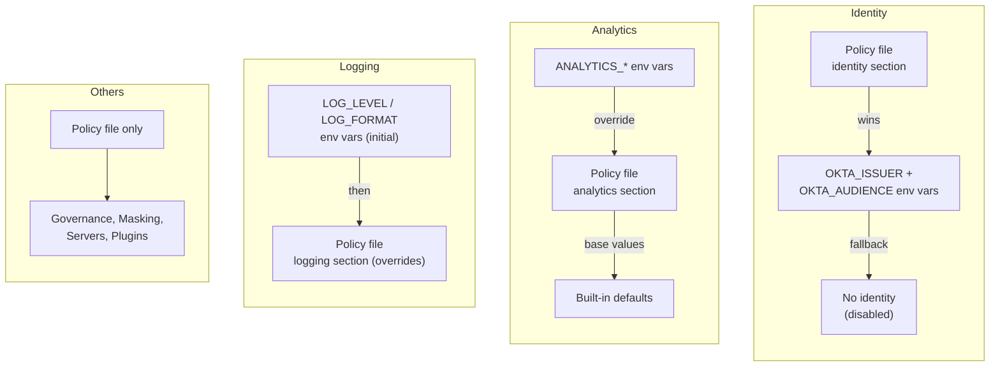
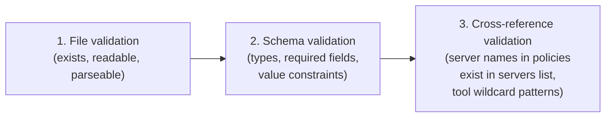
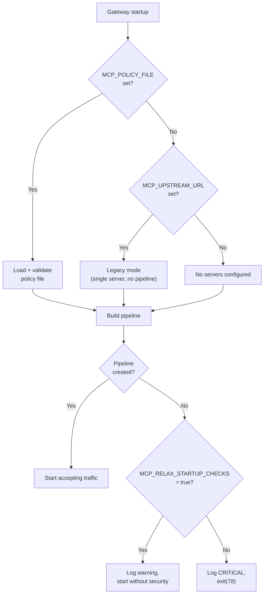

# Configuration Architecture

This document describes how mcp-zero loads, validates, and applies configuration at startup. It covers the two configuration sources (environment variables and policy files), the startup loading sequence, per-subsystem precedence rules, and fail-closed security defaults.

## Configuration Sources Overview

The gateway reads configuration from two sources:

| Source | Format | Role |
|--------|--------|------|
| **Environment variables** | Key-value strings | Connection secrets, host/port, feature flags, analytics overrides |
| **Policy file** | YAML (`.yaml`/`.yml`) or JSON (`.json`) | Identity provider, server definitions, governance rules, masking, logging, analytics, plugins |

Environment variables handle deployment-specific values that change between environments (URLs, secrets, ports). The policy file defines the security posture and is designed to be version-controlled.



> **Note:** Governance rules, server definitions, masking, and plugins are **policy-file only** — there are no env var equivalents. Identity and analytics accept configuration from both sources with different precedence rules (see [Configuration Precedence Rules](#configuration-precedence-rules)).

## Startup Loading Sequence

The `run()` function in `src/mcp_zero/main.py` executes the following steps in order:



| Step | What happens | Key source |
|------|-------------|------------|
| 1 | `configure_logging()` with `LOG_LEVEL` (default `INFO`) and `LOG_FORMAT` (default `json`) | `main.py` |
| 2 | Log warnings if `MCP_SKIP_TLS_VALIDATION` or `MCP_RELAX_STARTUP_CHECKS` are set | `main.py` |
| 3 | If `MCP_POLICY_FILE` is set, load and validate the policy file; otherwise fall back to `MCP_UPSTREAM_URL` legacy mode | `main.py` |
| 4 | If the policy file has a `logging` section, override the root logger level and format | `main.py` |
| 5 | Merge `ANALYTICS_*` env vars with policy `analytics` section (env wins) | `main.py` |
| 6 | Register hooks: Identity (priority 10), Governance (50), Plugins (declared), Analytics (145), Audit (150) | `main.py` |
| 7 | If no pipeline was built and `MCP_RELAX_STARTUP_CHECKS` is not set, exit with code 78 (`EX_CONFIG`) | `main.py` |
| 8 | Build OBO auth provider from `OKTA_TOKEN_ENDPOINT`, `OKTA_CLIENT_ID`, `OKTA_CLIENT_SECRET` | `main.py` |
| 9 | Wire `ServerManager`, `ProxyServer`, ASGI app | `main.py` |
| 10 | Start uvicorn on `MCP_HOST` (default `0.0.0.0`) / `MCP_PORT` (default `8080`) | `main.py` |

## Environment Variables Reference

### Core

| Variable | Description | Default |
|----------|-------------|---------|
| `MCP_POLICY_FILE` | Path to YAML/JSON policy file | *(none)* |
| `MCP_UPSTREAM_URL` | Legacy: single upstream server URL (used when no policy file) | *(none)* |
| `MCP_RELAX_STARTUP_CHECKS` | Allow startup without required security controls (`true`, `1`, `yes`). Dev/testing only. | `false` |
| `MCP_SKIP_TLS_VALIDATION` | Disable HTTPS enforcement on upstream server, identity issuer, and OBO URLs (`true`, `1`, `yes`). Dev/testing only. | `false` |
| `MCP_STRICT_SECURITY` | Require both identity AND governance at startup (`true`, `1`, `yes`) | `false` |
| `MCP_SSE_ENABLED` | Enable deprecated inbound SSE endpoints (`/mcp/sse*`) | `true` |
| `MCP_HOST` | Bind address for the gateway | `0.0.0.0` |
| `MCP_PORT` | Bind port for the gateway | `8080` |

### Identity / Okta

These env vars are **fallbacks** — if a policy file has an `identity` section, it takes precedence.

| Variable | Description | Default |
|----------|-------------|---------|
| `OKTA_ISSUER` | JWT issuer URL (e.g. `https://your-org.okta.com/oauth2/default`) | *(none)* |
| `OKTA_AUDIENCE` | Expected JWT audience claim | *(none)* |

> **Warning:** Setting `OKTA_ISSUER` without `OKTA_AUDIENCE` logs a warning and disables identity validation entirely.

### Identity / OBO Token Exchange

| Variable | Description | Default |
|----------|-------------|---------|
| `OKTA_TOKEN_ENDPOINT` | OAuth2 token endpoint for OBO exchange | *(none)* |
| `OKTA_CLIENT_ID` | Client ID for OBO token exchange | *(none)* |
| `OKTA_CLIENT_SECRET` | Client secret for OBO token exchange | *(none)* |

All three must be set for OBO to activate. If any server has `token_exchange: true` but these vars are missing, a warning is logged.

### Logging

| Variable | Description | Default |
|----------|-------------|---------|
| `LOG_LEVEL` | Initial log level (`DEBUG`, `INFO`, `WARNING`, `ERROR`, `CRITICAL`) | `INFO` |
| `LOG_FORMAT` | Output format: `json` (JSONL for log collectors) or `text` (color-coded for terminals) | `json` |
| `FORCE_COLOR` | Force color on/off for text format (`true`/`false`) | *(auto-detect TTY)* |

### Analytics

Environment variables **override** policy file values for analytics.

| Variable | Description | Default / Fallback |
|----------|-------------|--------------------|
| `ANALYTICS_REDIS_URL` | Redis connection URL (e.g. `redis://localhost:6379/0`) | *(none)* |
| `ANALYTICS_REDIS_CLUSTER` | Use Redis Cluster client (`true`/`false`) | `false` |
| `ANALYTICS_REDIS_PASSWORD` | Redis authentication password | *(none)* |
| `ANALYTICS_ENVIRONMENT` | Key namespace segment (e.g. `production`, `staging`) | `default` |
| `ANALYTICS_GATEWAY_ID` | Unique gateway instance ID | *(auto-generated 8-char hex)* |
| `ANALYTICS_KEY_PREFIX` | Redis key prefix for all analytics keys | `mcpgw` |
| `ANALYTICS_RETENTION_SECONDS` | TTL for analytics keys in seconds | `3600` |

## Policy File Schema

The policy file is loaded from the path in `MCP_POLICY_FILE`. It supports YAML (`.yaml`/`.yml`) or JSON (`.json`) format. All dataclasses are frozen (immutable after construction).

> For a full annotated example, see [`enterprise_mcp_gateway_policy_schema_example.md`](enterprise_mcp_gateway_policy_schema_example.md).

### Root Schema

| Field | Type | Required | Default | Description |
|-------|------|----------|---------|-------------|
| `version` | `int` | Yes | — | Must be `1` |
| `default` | `string` | No | `deny` | Default policy effect: `allow` or `deny` |
| `identity` | `object` | No | *(none)* | Identity provider configuration |
| `servers` | `list` | No | `[]` | Downstream MCP server definitions |
| `policies` | `list` | No | `[]` | Governance policy rules |
| `logging` | `object` | No | `{level: INFO, format: json}` | Logging overrides |
| `masking` | `object` | No | `{presidio: {enabled: false}}` | Data masking configuration |
| `analytics` | `object` | No | *(none)* | Analytics subsystem configuration |
| `plugins` | `list` | No | `[]` | Plugin declarations |

### Identity Section

```yaml
identity:
  provider: okta          # Required: provider name
  issuer: https://...     # Required: JWT issuer URL (HTTPS enforced)
  audience: mcp-gateway   # Required: expected audience claim
  claim_mapping:          # Optional: JWT claim → identity field mapping
    user_id: sub          # Default: "sub"
    email: email          # Default: "email"
    groups: groups        # Default: "groups"
```

| Field | Type | Required | Default | Description |
|-------|------|----------|---------|-------------|
| `provider` | `string` | Yes | — | Provider name (e.g. `okta`) |
| `issuer` | `string` | Yes | — | Token issuer URL (HTTPS required unless `allow_insecure`) |
| `audience` | `string` | Yes | — | Expected audience claim |
| `claim_mapping` | `object` | No | `{user_id: sub, email: email, groups: groups}` | JWT claim mappings |

### Servers Section

Each entry defines a downstream MCP server. Server names must be unique.

**HTTP transport:**

```yaml
servers:
  - name: internal-mcp
    transport: http
    url: https://mcp.internal.corp/mcp
    token_exchange: true        # Optional: enable OBO
    target_audience: api://mcp  # Required when token_exchange is true
    required_scopes:            # Optional: OBO scopes
      - mcp.read
```

**SSE transport (deprecated):**

```yaml
servers:
  - name: legacy-sse-server
    transport: sse
    url: https://legacy.example.com/sse
```

**stdio transport:**

```yaml
servers:
  - name: local-tools
    transport: stdio
    command: python
    args: ["-m", "my_mcp_server"]
    env:
      API_KEY: "${SECRET}"
```

| Field | Type | Required | Default | Description |
|-------|------|----------|---------|-------------|
| `name` | `string` | Yes | — | Unique server identifier |
| `transport` | `string` | Yes | — | `http`, `sse`, or `stdio` |
| `url` | `string` | HTTP only | — | Upstream URL (HTTPS enforced) |
| `command` | `string` | stdio only | — | Executable to launch |
| `args` | `list[string]` | No | `[]` | Command arguments (stdio) |
| `env` | `object` | No | `{}` | Environment variables (stdio) |
| `token_exchange` | `bool` | No | `false` | Enable OBO token exchange (HTTP only) |
| `target_audience` | `string` | No | *(none)* | OBO target audience (required when `token_exchange` is true) |
| `required_scopes` | `list[string]` | No | `[]` | OBO required scopes |

### Policies Section

Each rule defines who can access which servers/tools. Policy IDs must be unique.

```yaml
policies:
  - id: allow-platform-ops
    description: Allow Platform Ops team to use internal tools
    effect: allow
    subjects:
      groups:
        - platform-ops
    mcp_servers:
      - name: internal-mcp
        tools: ["read_*", "list_*"]  # Wildcard patterns
  - id: deny-dangerous-tools
    description: Deny destructive tools for all users
    effect: deny
    subjects:
      users: ["*"]
    mcp_servers:
      - name: "*"                    # Wildcard server name
        tools: ["delete_*", "drop_*"]
```

| Field | Type | Required | Default | Description |
|-------|------|----------|---------|-------------|
| `id` | `string` | Yes | — | Unique rule identifier |
| `description` | `string` | Yes | — | Human-readable description |
| `effect` | `string` | No | `allow` | `allow` or `deny` |
| `subjects.users` | `list[string]` | No | `[]` | User identifiers |
| `subjects.groups` | `list[string]` | No | `[]` | Group names |
| `mcp_servers` | `list` | No | `[]` | Server/tool access patterns |
| `mcp_servers[].name` | `string` | Yes | — | Server name (supports wildcards) |
| `mcp_servers[].tools` | `list[string]` | No | `[]` | Tool name patterns |

**Wildcard patterns** for tools: `*` (match all), `prefix*` (suffix wildcard), `*suffix` (prefix wildcard). Middle wildcards (`read*write`) and multiple wildcards (`*_*`) are rejected at validation.

### Logging Section

```yaml
logging:
  level: DEBUG
  format: text
  include:
    - audit
    - masking
```

| Field | Type | Default | Description |
|-------|------|---------|-------------|
| `level` | `string` | `INFO` | `DEBUG`, `INFO`, `WARNING`, `ERROR`, `CRITICAL` |
| `format` | `string` | `json` | `json` (JSONL) or `text` (color-coded) |
| `include` | `list[string]` | `[]` | Log categories to include |

### Masking Section

```yaml
masking:
  presidio:
    enabled: true
    entities:
      - PERSON
      - EMAIL_ADDRESS
      - PHONE_NUMBER
      - CREDIT_CARD
```

| Field | Type | Default | Description |
|-------|------|---------|-------------|
| `presidio.enabled` | `bool` | `false` | Enable Presidio PII masking |
| `presidio.entities` | `list[string]` | `[]` | PII entity types to detect |

### Analytics Section

```yaml
analytics:
  redis:
    url: redis://localhost:6379/0
    cluster: false
    tls: false
    password: null
    socket_timeout: 5.0
    retry_on_timeout: true
  environment: production
  gateway_id: gw-east-1
  key_prefix: mcpgw
  bucket_seconds: 60
  retention_seconds: 3600
  heartbeat_seconds: 30
  queue_size: 10000
  flush_interval: 1.0
```

| Field | Type | Default | Description |
|-------|------|---------|-------------|
| `redis.url` | `string` | `""` | Redis connection URL |
| `redis.cluster` | `bool` | `false` | Use Redis Cluster client |
| `redis.tls` | `bool` | `false` | Enable TLS |
| `redis.password` | `string` | *(none)* | Authentication password |
| `redis.socket_timeout` | `float` | `5.0` | Socket timeout in seconds |
| `redis.retry_on_timeout` | `bool` | `true` | Retry on timeout errors |
| `environment` | `string` | `default` | Key namespace segment |
| `gateway_id` | `string` | *(auto-generated)* | Unique gateway instance ID |
| `key_prefix` | `string` | `mcpgw` | Redis key prefix |
| `bucket_seconds` | `int` | `60` | Time bucket width |
| `retention_seconds` | `int` | `3600` | TTL for analytics keys |
| `heartbeat_seconds` | `int` | `30` | Heartbeat interval |
| `queue_size` | `int` | `10000` | In-memory event queue depth |
| `flush_interval` | `float` | `1.0` | Background flush interval (seconds) |

### Plugins Section

```yaml
plugins:
  - name: presidio-masking
    package: presidio-masking    # Defaults to name if omitted
    priority: 100                # Optional hook priority override
    config:
      entities: [PERSON, EMAIL_ADDRESS]
```

| Field | Type | Required | Default | Description |
|-------|------|----------|---------|-------------|
| `name` | `string` | Yes | — | Unique plugin identifier |
| `package` | `string` | No | *(same as name)* | Entry-point package name |
| `config` | `object` | No | `{}` | Plugin-specific configuration |
| `priority` | `int` | No | *(none)* | Hook registration priority override |

Plugin names must be unique. Plugins are discovered via Python `importlib.metadata` entry points in the `mcp_zero.plugins` group. See [`plugin-architecture-design.md`](plugin-architecture-design.md) for details.

## Configuration Precedence Rules

Different subsystems follow different precedence rules depending on their operational needs:



### Per-Subsystem Details

| Subsystem | Precedence | Explanation |
|-----------|-----------|-------------|
| **Identity** | Policy file wins, env vars are fallback | If the policy file has an `identity` section, it is used and `OKTA_ISSUER`/`OKTA_AUDIENCE` env vars are ignored. Env vars only apply when no policy file identity section exists. |
| **Analytics** | Env vars win, policy file provides base | `_build_analytics_config()` starts from policy file values, then overrides individual fields with `ANALYTICS_*` env vars when set. This lets operators tune analytics per deployment without changing the policy file. |
| **Logging** | Env vars initialize, policy file overrides | `LOG_LEVEL` and `LOG_FORMAT` set the initial logging config. If the policy file has a `logging` section, it overrides the root logger level and format after policy load. |
| **Governance** | Policy file only | Rules, default effect, and server access controls are defined exclusively in the policy file. |
| **Masking** | Policy file only | Presidio entity types and enabled flag come from the policy file. |
| **Servers** | Policy file only | Server definitions (transport, URL, command, OBO) come from the policy file. Legacy `MCP_UPSTREAM_URL` is used only when no policy file is configured. |
| **Plugins** | Policy file only | Plugin declarations (name, package, config, priority) are defined in the policy file. |
| **Host/Port** | Env vars only | `MCP_HOST` and `MCP_PORT` are always read from environment variables. |

## Validation and Error Handling

Policy file validation uses a three-tier approach implemented in `src/mcp_zero/governance/loader.py`:



### Error Types

| Error | Parent | When raised | Example |
|-------|--------|-------------|---------|
| `GovernanceError` | `Exception` | Base class for all governance errors | — |
| `PolicyFileError` | `GovernanceError` | File not found, unreadable, parse failure, unsupported extension | `Policy file not found: /etc/mcp/policy.yaml` |
| `PolicyValidationError` | `GovernanceError` | Missing required fields, invalid types, invalid enum values, duplicate names/IDs | `Missing required field: version` |
| `PolicyReferenceError` | `PolicyValidationError` | Policy rule references a server name that does not exist in the `servers` list | `Policy 'rule-1' references unknown server 'nonexistent'` |

All validation errors are raised at startup (fail-fast), before the gateway accepts any traffic. The `field` attribute on validation errors identifies the specific path to the invalid field (e.g. `policies[0].mcp_servers[1]`).

### Dataclass Validation

Each frozen dataclass performs its own validation in `__post_init__`:

- `PolicyConfig` — validates `version == 1`
- `IdentityProviderConfig` — requires `provider`, `issuer`, `audience`; enforces HTTPS on `issuer`
- `ServerDefinition` — requires `name`; validates `transport` is `http`, `sse`, or `stdio`
- `ServerConfig` — requires `url` for HTTP, `command` for stdio; enforces HTTPS; validates OBO constraints
- `PolicyRule` — requires `id` and `description`
- `PolicyServerAccess` — requires `name`
- `LoggingConfig` — validates `level` against allowed values; validates `format` is `json` or `text`
- `PluginDeclaration` — requires `name`

## Security Defaults and Fail-Closed Behavior

The gateway is designed to be secure by default. It will refuse to start without security controls unless explicitly overridden.



### Security Defaults

| Default | Description |
|---------|-------------|
| **Fail-closed startup** | Gateway refuses to start without identity or policy configuration. Exit code 78 (`EX_CONFIG` per `sysexits.h`). Override with `MCP_RELAX_STARTUP_CHECKS=true` (dev only). |
| **Default deny** | Policy `default` field defaults to `deny` — requests without a matching allow rule are rejected. |
| **HTTPS enforcement** | Identity issuer URLs and HTTP server URLs must use HTTPS. Override with `allow_insecure: true` in the policy file or `MCP_SKIP_TLS_VALIDATION=true` env var. |
| **Frozen dataclasses** | All configuration objects are frozen (`@dataclass(frozen=True)`), preventing runtime mutation after construction. |
| **No hot-reload** | Policy files are loaded once at startup. Changes require a restart. |
| **Explicit plugin loading** | Plugins must be declared in the policy file to activate — no auto-discovery of installed packages. |

## Pipeline Hook Priorities

Hooks execute in priority order (lowest number runs first). These are the built-in hook priorities:

| Priority | Hook | Purpose |
|----------|------|---------|
| 10 | Identity | JWT validation, user extraction |
| 50 | Governance | Policy evaluation, allow/deny decisions |
| *(declared)* | Plugins | Plugin-declared hooks (priority set in plugin or policy) |
| 145 | Analytics | Request/response metrics collection |
| 150 | Audit | Structured audit logging |

> **Note:** Plugins can declare a custom `priority` in the policy file to control their position in the pipeline relative to built-in hooks.

## Operational Modes

The gateway supports three operational modes depending on configuration:

| Mode | Config required | Identity | Governance | Masking | Analytics | Use case |
|------|----------------|----------|------------|---------|-----------|----------|
| **Full policy** | `MCP_POLICY_FILE` with `identity` section | Enabled | Enabled | Per-policy | Optional | Production |
| **Policy without identity** | `MCP_POLICY_FILE` without `identity`, plus `OKTA_ISSUER` + `OKTA_AUDIENCE` | Env-var fallback | Enabled | Per-policy | Optional | Staging / hybrid |
| **Insecure** | `MCP_RELAX_STARTUP_CHECKS=true` | Disabled | Disabled | Disabled | Optional | Development / testing |

> **Note:** `MCP_SKIP_TLS_VALIDATION=true` can be combined with any mode to disable HTTPS enforcement on URLs (dev only). `MCP_STRICT_SECURITY=true` can be added to the Full policy mode to require both identity and governance.

In all modes, the audit hook is registered whenever a pipeline exists.

## Related Documentation

- [Policy Schema Example](enterprise_mcp_gateway_policy_schema_example.md) — full annotated YAML policy file
- [Architecture Diagram](enterprise_mcp_gateway_architecture_diagram.md) — logical architecture overview
- [Plugin Architecture Design](plugin-architecture-design.md) — plugin system design and entry-point discovery
- [OBO Token Exchange](okta_obo_for_an_enterprise_mcp_gateway.md) — Okta On-Behalf-Of flow details
- [Analytics Redis Plan](analytics-redis-plan.md) — Redis analytics subsystem design
- [PRD](prd.md) — full product requirements
- [Security Review](security_review_mcp_gateway.md) — security analysis and threat model
- [Threat Model Canvas](enterprise_mcp_gateway_threat_model_canvas.md) — STRIDE-based threat model
