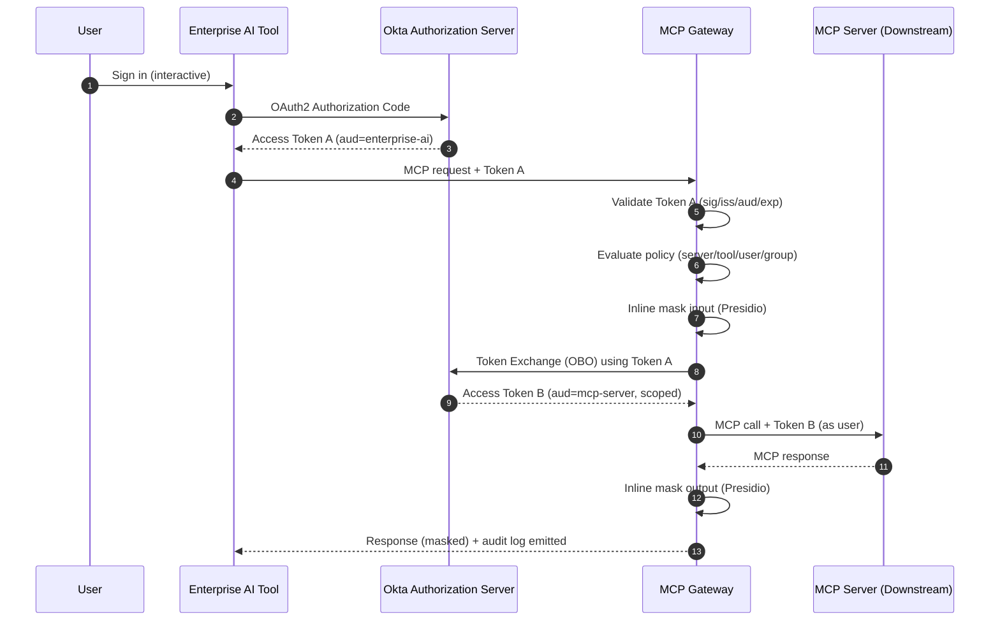

> **IMPLEMENTATION STATUS**: The OBO token exchange infrastructure described in this document is **FULLY IMPLEMENTED** and operational in the codebase.
> However, it requires explicit configuration via environment variables (`OKTA_TOKEN_ENDPOINT`, `OKTA_CLIENT_ID`, `OKTA_CLIENT_SECRET`) and per-server policy settings (`token_exchange: true`, `target_audience`).
> When OBO is not configured or not enabled for a server, **no authorization token** (neither exchanged nor original) is forwarded to that downstream server.
> This document describes the implemented architecture and its configuration requirements.

---

## Okta OBO (On-Behalf-Of) Explained for an Enterprise MCP Gateway

This document explains **On-Behalf-Of (OBO)** token exchange in the specific context of:
- Okta as the IdP
- An Enterprise MCP Gateway deployed in the enterprise network
- A requirement to execute MCP tool calls **as the current user**

---

## 1) What OBO Is (Precise Definition)

**OBO is a delegated-authorization pattern** where a trusted backend exchanges a **user token** issued for one audience (resource) into a **new user token** issued for a different audience (downstream resource).

The result is a downstream call that:
- still represents the same user
- is constrained by the user’s delegated permissions
- is valid for the downstream system (correct audience/scope)

---

## 2) Why OBO Exists (Problem OBO Solves)

In enterprises, a user token is usually minted for a specific resource (audience), such as:
- enterprise-ai
- internal-agent
- chat-tool

Downstream APIs/MCP servers typically require tokens minted for *their* audience, such as:
- github-mcp
- internal-infra-mcp
- jira-mcp

If you forward the original token, the downstream resource may reject it (wrong audience/scopes). If you use a service account, you lose user attribution and least privilege.

OBO is the standard way to preserve user identity and permissions across service boundaries.

---

## 3) OBO in MCP Gateway Terms

### Actors
- **User**: authenticates interactively
- **Enterprise AI Tool**: primary client UX
- **Okta**: authorization server
- **MCP Gateway**: trusted intermediary
- **MCP Server**: downstream resource/API

### Tokens
- **Token A**: user token for the Enterprise AI Tool audience
- **Token B**: user token for the MCP server audience (minted via OBO)

---

## 4) End-to-End Sequence Diagram (Recommended Pattern)



> **Note**: This sequence diagram shows the flow when OBO is configured and enabled for the target server. Steps 7-8 (token exchange with Okta) only occur when:
> - Environment variables `OKTA_TOKEN_ENDPOINT`, `OKTA_CLIENT_ID`, and `OKTA_CLIENT_SECRET` are set
> - The target server has `token_exchange: true` and `target_audience` configured in the policy file
>
> When OBO is not configured or not enabled for a server, steps 7-8 are skipped and **no Authorization header** is sent to the downstream MCP server (the gateway calls it without authentication).

---

## 4.5) Transport Applicability

OBO token exchange is designed for service-to-service boundaries. Its applicability depends on the MCP transport:

### HTTP-based MCP servers
- OBO applies directly — the gateway exchanges the user's token for a downstream token scoped to the MCP server's audience
- This is the primary OBO use case described in this document

### stdio-based MCP servers (gateway-managed)
- The MCP server runs as a subprocess of the gateway — there is no network boundary or separate audience
- OBO token exchange is **not needed** for stdio servers; the gateway propagates user identity via its own process context
- Governance and audit attribution are maintained by the gateway wrapping all stdio communication with the same policy evaluation and audit pipeline
- If a stdio-managed MCP server needs to make its own downstream HTTP calls, the gateway can provide delegated credentials through environment or configuration

### Key principle
Governance and audit attribution are maintained regardless of transport. OBO solves the specific problem of crossing audience boundaries over HTTP; stdio servers under gateway management do not cross that boundary.

---

## 5) Forward vs Exchange (Decision Rule)

### Forward the user token (Token A) when:
- the MCP server accepts Token A (correct audience)
- the resource server trusts the same Okta authorization server
- scopes/claims are already sufficient

### Use OBO token exchange when:
- the MCP server requires a different audience
- you need different scopes
- you need stricter isolation per downstream system
- you are calling external/third-party MCP servers behind an API gateway

### stdio transport (gateway-managed servers):
- Token forwarding and exchange are **not applicable** — the server runs as a gateway subprocess
- User identity is maintained via the gateway's process context
- If the stdio server needs to call downstream HTTP APIs, the gateway can inject delegated credentials via environment or configuration

Practical enterprise default: **prefer exchange** for HTTP downstream calls; **rely on gateway process context** for stdio servers.

> **Current Limitation**: When OBO is not configured (missing environment variables) or not enabled for a specific server (policy file settings), the gateway does not forward any authorization token to that server. This means the downstream server receives requests without authentication. For production use, configure OBO for all HTTP-based MCP servers that require user authentication.

---

## 6) Good vs Bad Examples

### Good Example: OBO (Delegated User)
**Scenario:** Developer uses MCP to read GitHub issues.
- User logs into enterprise AI tool
- Gateway validates user
- Gateway exchanges for a github-mcp token
- GitHub MCP server logs action as the user

**Why it’s good**
- Attribution preserved
- Least privilege enforced
- Auditable by user/group/scope

---

### Bad Example: Service Account (Non-Delegated)
**Scenario:** Gateway uses a single service account to call all MCP servers.

**What goes wrong**
- Downstream systems see “gateway-service” not the user
- Audits cannot prove who did what
- A compromise becomes catastrophic (broad permissions)
- Security teams will block this model

---

### Bad Example: Forwarding Wrong-Audience Tokens
**Scenario:** Gateway forwards Token A to a downstream system expecting Token B.

**What goes wrong**
- Downstream rejects calls (audience mismatch)
- Teams work around by disabling token checks
- Security posture degrades

---

## 7) Security Explainer (How to Defend OBO)

### What Security Usually Asks
1. Does this preserve user identity?
2. Can the gateway mint tokens for any user?
3. Is privilege constrained per resource?
4. Is this auditable?

### Security Answers
- OBO **requires a real user token** as the assertion.
- The gateway cannot act for users who are not authenticated.
- The authorization server enforces:
  - which clients can perform exchange
  - which audiences are allowed
  - which scopes are granted
- Every request can be logged:
  - original user identity
  - target audience/scope
  - policy decision

### Security Posture Summary
OBO is **delegated authorization**, not impersonation.

---

## 8) Okta-Specific Implementation and Configuration

### Okta Prerequisites

To support OBO in Okta, you need:
- A **Custom Authorization Server** (API Access Management)
- Token exchange enabled/allowed for the gateway client
- Audience and scope design per MCP server
- Group claims configured (if governance relies on groups)

### Gateway Configuration

The gateway implements OBO via three required environment variables:

| Environment Variable | Description | Example |
|---------------------|-------------|---------|
| `OKTA_TOKEN_ENDPOINT` | OAuth2 token endpoint for token exchange | `https://your-tenant.okta.com/oauth2/default/v1/token` |
| `OKTA_CLIENT_ID` | Gateway's OAuth2 client ID | `0oa1b2c3d4e5f6g7h8i9` |
| `OKTA_CLIENT_SECRET` | Gateway's OAuth2 client secret | `secret-value-here` |

> **Note**: All three environment variables must be set for OBO to be enabled. If any are missing, the gateway will not perform token exchange, and no authorization tokens will be forwarded to downstream servers.

### Per-Server Policy Configuration

Each MCP server in your policy file must be configured with OBO settings:

```yaml
servers:
  - name: github-mcp
    url: https://github-mcp.internal.example.com
    transport: http
    token_exchange: true              # Enable OBO for this server
    target_audience: github-mcp       # Audience for exchanged token
    required_scopes:                  # Scopes to request
      - read:repos
      - read:issues
```

**Configuration fields:**
- `token_exchange` (boolean): Enable OBO token exchange for this server
- `target_audience` (string, required when `token_exchange: true`): The audience claim for the exchanged token
- `required_scopes` (list of strings, optional): Scopes to request in the exchanged token

The gateway:
- Validates incoming access tokens (JWT validation via `IdentityHook`)
- Exchanges tokens for downstream audiences (via `OBOClient` implementing RFC 8693)
- Caches exchange results safely (short TTL, configurable via `OBOConfig.cache_ttl`, default 300s)
- Logs exchange failures and denies requests that cannot be authenticated

---

## 9) Operational & Failure Modes

### If token exchange fails
- Deny the request
- Emit an audit event with reason

### If Presidio fails
- Recommended default: deny (fail closed) for external MCP servers
- Log reason and correlation ID

### If policy file invalid
- Fail startup
- Prevent silent permissive behavior

---

## 10) Practical Guidance for Production Deployment

### Implementation Status

The gateway implements OBO as a pluggable module (`OBOAuthProvider`) with:
- Per-server configuration via policy file (`token_exchange`, `target_audience`, `required_scopes`)
- RFC 8693 compliant token exchange via `OBOClient`
- Token caching with configurable TTL to minimize exchange overhead
- Comprehensive logging of upstream user token subject and downstream audience/scope

### Deployment Checklist

1. **Configure Okta**:
   - Set up Custom Authorization Server
   - Create gateway client with token exchange permissions
   - Define audiences for each downstream MCP server
   - Configure scopes per server requirements

2. **Set environment variables**:
   ```bash
   export OKTA_TOKEN_ENDPOINT=https://your-tenant.okta.com/oauth2/default/v1/token
   export OKTA_CLIENT_ID=your-client-id
   export OKTA_CLIENT_SECRET=your-client-secret
   ```

3. **Configure policy file** with per-server OBO settings:
   ```yaml
   servers:
     - name: your-server
       token_exchange: true
       target_audience: your-server-audience
       required_scopes: [scope1, scope2]
   ```

4. **Monitor logs** for:
   - Token exchange failures (`TokenExchangeError`)
   - Unauthorized access attempts
   - OBO cache hit/miss patterns

### Production Considerations

- All HTTP-based MCP servers should have `token_exchange: true` in production
- Servers without OBO configuration will receive unauthenticated requests
- Token exchange failures result in request denial (fail-closed security model)
- Cache TTL (default 300s) should be tuned based on your security requirements

---

## 11) Short Executive Explanation

“OBO lets the gateway call downstream MCP servers with a token that represents the same user, but scoped and audience-bound to that downstream system, so Security can approve MCP usage without losing attribution or least privilege.”

